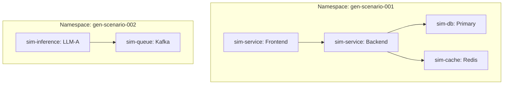

# Data Generation Strategy: The Simulation Cluster

To generate diverse training data for 150+ failure scenarios without managing 29 different container images, we will use a **"Simulation Cluster"** approach. Instead of 1:1 mappings, we will use **6 Core Archetypes** that can be configured to simulate various roles.

## 1. The 6 Core Container Archetypes

We do **not** need 29 types. We only need these 6 flexible containers:

### A. `sim-service-agent` (The Workhorse)
**Covers:** API, Microservices, Serverless, Security, Load Balancer, Observability, Config.
- **Tech:** Python (FastAPI) or Go.
- **Capabilities:**
  - Configurable HTTP/gRPC endpoints.
  - "Bad Behavior" flags: `leak_memory=true`, `burn_cpu=true`, `block_thread=true`.
  - Upstream/Downstream calling (to simulate mesh/cascades).
  - Configurable logging (to simulate log floods).

### B. `sim-db` (The State)
**Covers:** Database, Storage, Connection Pools.
- **Tech:** PostgreSQL + Sidecar Agent.
- **Capabilities:**
  - Stores dummy data.
  - Agent can: Lock tables, consume connections, saturate disk I/O, corrupt files.

### C. `sim-cache` (The Accelerator)
**Covers:** Caching, CDN (simulated).
- **Tech:** Redis + Sidecar Agent.
- **Capabilities:**
  - Configurable TTLs (to cause stampedes).
  - Agent can: Flush all keys, block port, fill memory.

### D. `sim-queue` (The Messenger)
**Covers:** Event-Driven, Streaming.
- **Tech:** Kafka or NATS + Producer/Consumer Agents.
- **Capabilities:**
  - Agent can: Flood messages, stop consumption (lag), send poison pills.

### E. `sim-inference` (The GPU Consumer)
**Covers:** AI/ML Inference, GPU.
- **Tech:** Python (PyTorch stub).
- **Capabilities:**
  - Allocates VRAM.
  - Performs matrix multiplications (heats up GPU).
  - Simulates model loading latency.

### F. `chaos-controller` (The Orchestrator)
**Covers:** Infrastructure, K8s, Network, Cloud, GitOps.
- **Tech:** Go (Kubernetes Operator).
- **Capabilities:**
  - Does not run *as* a service, but *acts on* them.
  - Deletes pods, drains nodes, modifies NetworkPolicies, edits secrets.

## 2. Parallelization Strategy

To parallelize data generation, we will run **multiple isolated namespaces**, each running a "Scenario Instance".

1.  **Batch Processing**: We can spin up 10 namespaces at a time.
2.  **Scenario Mapping**:
    - `API-001` -> Deploys 1 `sim-service`.
    - `SVC-004` (Cascading) -> Deploys Chain of 3 `sim-services`.
    - `DB-004` (Deadlock) -> Deploys 1 `sim-db` + 2 Clients.

## 3. Implementation Roadmap

1.  **Build the 6 Images**: Create Dockerfiles for the archetypes.
2.  **Define Topologies**: Create Helm charts or Kustomize bases for common topologies (e.g., "3-tier-app", "async-worker", "inference-cluster").
3.  **The Generator Script**: A script that:
    - Picks a Scenario from `failure_scenarios.yaml`.
    - Deploys the required Topology.
    - Triggers the Fault (via `chaos-controller` or Env Var).
    - Records Metrics (Prometheus) -> Saves to Dataset.
