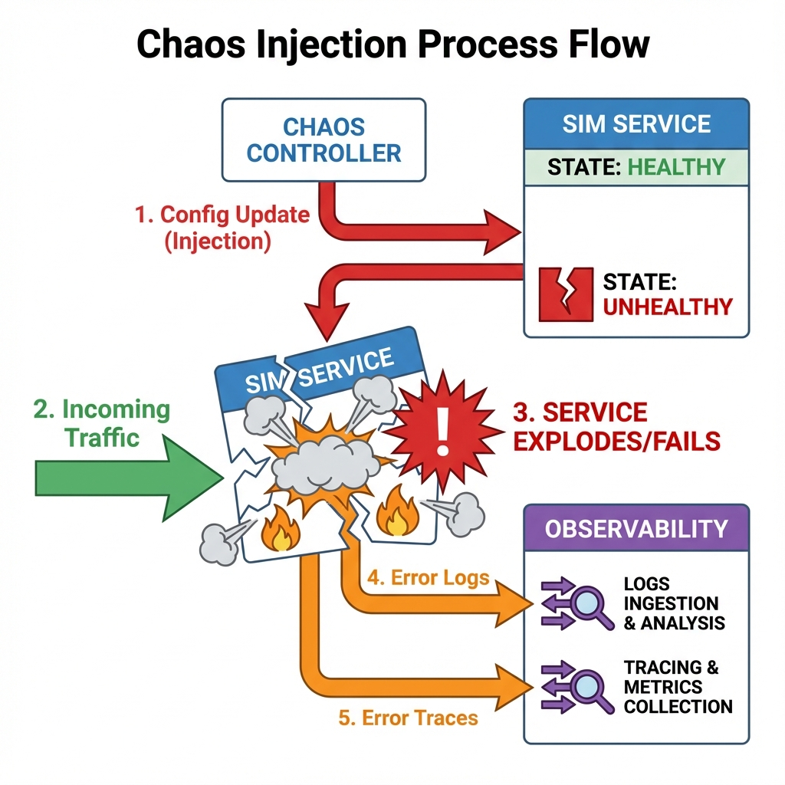
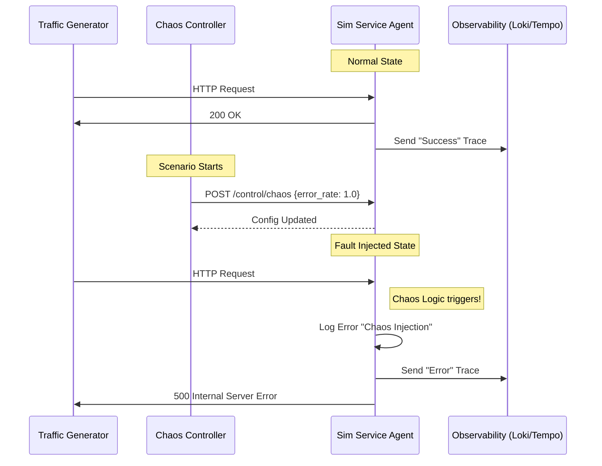

# Architecture & Data Flow Explanation

Here are the detailed answers to your questions regarding the Heimr.ai architecture.

## 1. What are the simulators sending to the simulator service?
**Nothing.** The direction is actually the opposite.
*   The **`sim-service-agent`** acts as the **Gateway / Proxy**.
*   It receives incoming HTTP requests (traffic) and then calls the downstream simulators (`sim-db`, `sim-cache`, `sim-queue`, `sim-inference`) to fulfill those requests.
*   The downstream simulators respond *back* to the `sim-service-agent`.

## 2. What is chaos controller sending to sim service?
The **Chaos Controller** sends **configuration commands** (JSON payloads), not user traffic.
*   It calls the `POST /control/chaos` endpoint on the `sim-service-agent`.
*   **Payload Example:** `{"latency_ms": 500, "error_rate": 0.1}`
*   This tells the service to *start misbehaving* (e.g., sleeping for 500ms or throwing 500 errors) for subsequent user requests.

## 3. Who generates the logs with errors?
The **Application Code** inside `sim-service-agent` (and other agents) generates the logs.
*   It uses a custom **JSON Logger** (configured in `main.py`).
*   When a chaos fault triggers (e.g., `if random.random() < error_rate`), the code explicitly logs an error: `logger.error("Chaos injection: returning 500 error...")`.
*   These logs are written to `stdout`, picked up by **Promtail**, and sent to **Loki**.

## 4. Who generates the traces with errors?
The **OpenTelemetry SDK** running inside the `sim-service-agent` process generates the traces.
*   The application is instrumented with `FastAPIInstrumentor`.
*   When a request comes in, the SDK starts a "Span".
*   If the application raises an exception (or returns a 500 status code due to chaos), the SDK marks the Span as "Error" and adds exception details.
*   These spans are exported asynchronously to **Tempo**.

## 5. Where is OpenTelemetry?
**OpenTelemetry is a library, not a separate service.**
*   It is installed as a Python package (`opentelemetry-sdk`, `opentelemetry-instrumentation-fastapi`) inside the `sim-service-agent` container.
*   It runs *within* the application process.
*   It is responsible for collecting the trace data and "pushing" it out to the **Tempo** service (at `observability:4317`).

## 6. Why is it showing RabbitMQ in Simulator queue?
**That was a labeling error in the previous diagram.**
*   We verified the source code of `sim-queue-agent`, and it explicitly imports `aiokafka` and generates **Kafka** metrics (`kafka_producer_...`, `kafka_consumer_...`).
*   It is simulating a **Kafka** workload.

## 7. What does the data pipeline script send to sim service?
**Currently, Nothing.** (This is the root cause of our missing traces).
*   The `run_gke_generation.py` script does two things:
    1.  **Triggers Chaos:** Calls `chaos-controller` to start a scenario.
    2.  **Scrapes Data:** Calls `Prometheus`, `Loki`, and `Tempo` to download telemetry.
*   **Missing Piece:** It *should* also be sending HTTP traffic (load) to `sim-service-agent` to generate the traces it tries to collect. Because it doesn't, the service sits idle, and no traces are created.

---

## fluences the Service, and how the Service generates telemetry in response to User Traffic.

