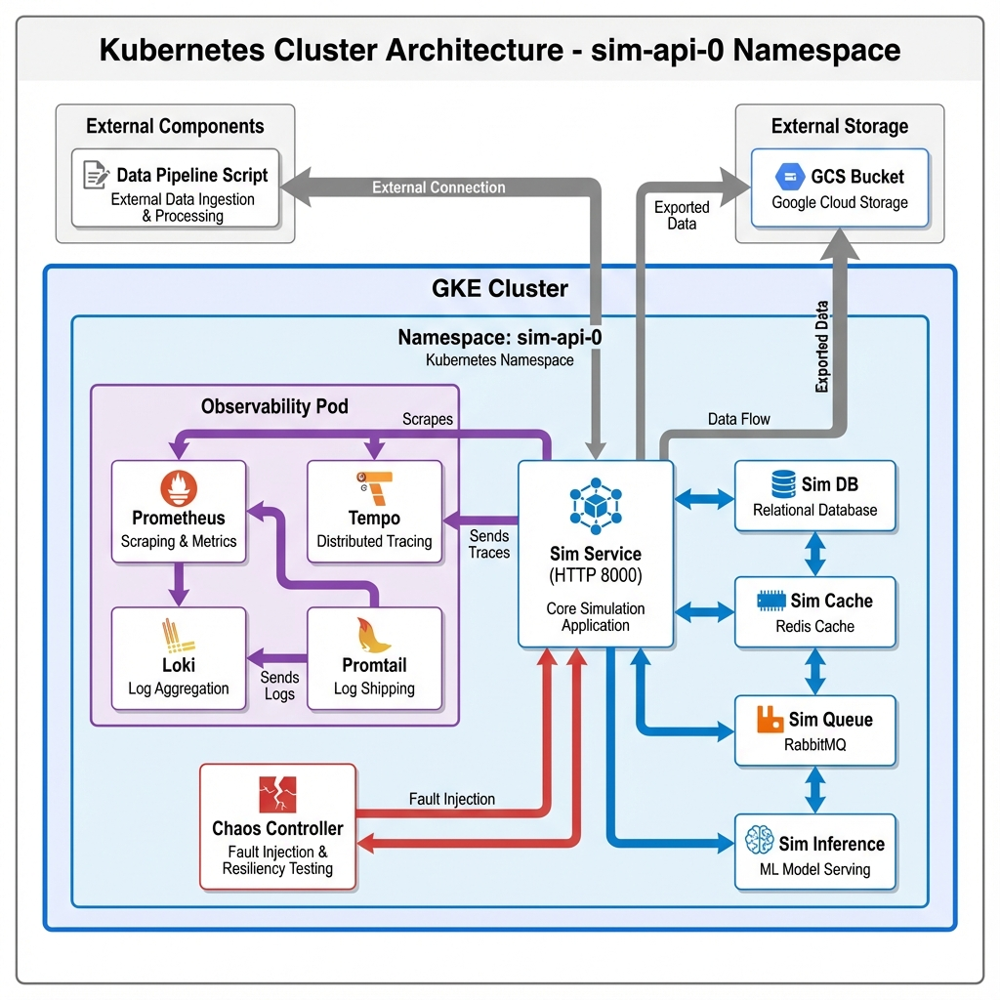
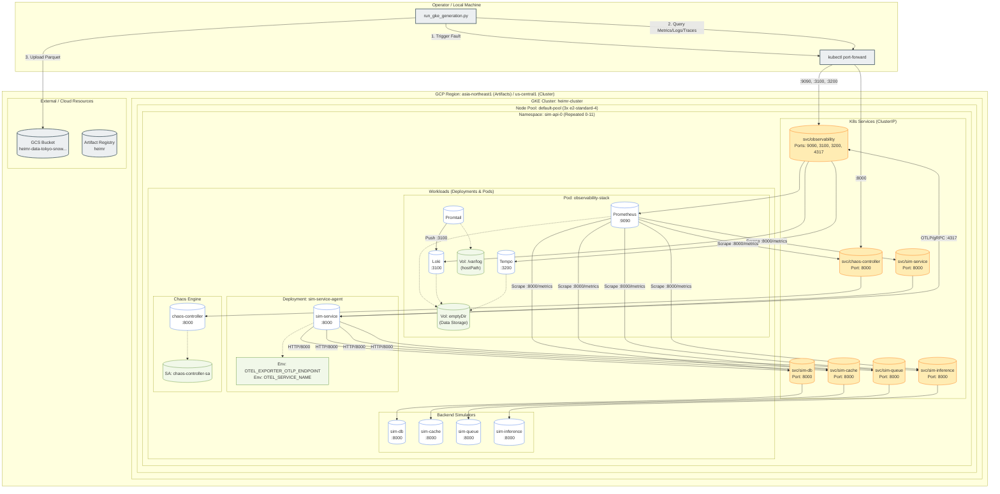

# Heimr.ai Detailed Architecture

This document provides a comprehensive technical view of the Heimr.ai infrastructure, including Kubernetes resources, network configurations, and data flows.

## Network Configuration Details

| Service Name | Type | Ports | Target | Description |
| :--- | :--- | :--- | :--- | :--- |
| `observability` | ClusterIP | `9090` (Prometheus) `3100` (Loki) `3200` (Tempo) `4317` (OTLP gRPC) | `observability-stack` Pod | Central monitoring entry point. |
| `sim-service` | ClusterIP | `8000` (HTTP) | `sim-service-agent` | Main entry point for simulator topology. |
| `sim-db` | ClusterIP | `8000` (HTTP) | `sim-db` | Simulated Database backend. |
| `sim-cache` | ClusterIP | `8000` (HTTP) | `sim-cache` | Simulated Cache backend. |
| `sim-queue` | ClusterIP | `8000` (HTTP) | `sim-queue` | Simulated Message Queue. |
| `sim-inference` | ClusterIP | `8000` (HTTP) | `sim-inference` | Simulated LLM Inference Engine. |
| `chaos-controller` | ClusterIP | `8000` (HTTP) | `chaos-controller` | Fault injection controller. |

## Volume & Storage Configuration

*   **Logs**: `observability-stack` mounts `/var/log` from the host node (via `hostPath`) to allow Promtail to scrape container logs from all pods on that node.
*   **Data Persistence**: Currently using `emptyDir` for Prometheus, Loki, and Tempo storage. Data is ephemeral and lost on Pod restart.
*   **Secrets**: GCS credentials (if used by in-cluster generator) are mounted as Secrets.

## Telemetry Flow

1.  **Metrics**: Prometheus pulls metrics from all services via standard `/metrics` endpoint on port `8000`.
2.  **Logs**: Promtail (DaemonSet-style behavior, though running as sidecar here) reads node logs and pushes to Loki on `localhost:3100`.
3.  **Traces**: `sim-service-agent` is instrumented with OpenTelemetry. It pushes traces to `http://observability:4317` (which routes to Tempo).
